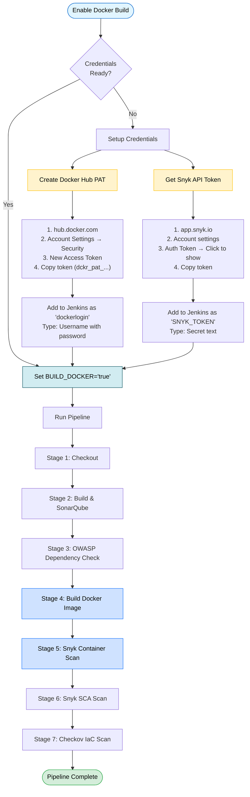

# DevSecOps Docker Environment

This Docker Compose setup provides a complete DevSecOps CI/CD environment for the easybuggy project.

## Components

- **SonarQube** (port 9000): Code quality and security analysis
- **Jenkins** (port 8080): CI/CD automation with DevSecOps tools

## Pre-installed Tools in Jenkins

- Maven 3.8.7
- Docker CLI
- Snyk CLI
- Checkov
- Terraform

## Quick Start

1. **Start the environment:**
   ```bash
   cd easybuggy/docker
   docker-compose up -d --build
   ```

2. **Wait for services to be healthy:**
   ```bash
   docker-compose ps
   ```

3. **Access the services:**
   - Jenkins: http://localhost:8080 (admin/admin)
   - SonarQube: http://localhost:9000 (admin/admin)

## Initial Setup

### SonarQube Configuration

1. Login to SonarQube (admin/admin) - you'll be prompted to change the password
2. Generate a project token:
   - Go to Administration > Security > Users
   - Click on "Tokens" for the admin user
   - Generate a new token named `jenkins`
   - Copy the token

### Jenkins Configuration

1. Login to Jenkins (admin/admin)
2. Add the SonarQube token as a credential:
   - Go to Manage Jenkins > Credentials
   - Add a "Secret text" credential with ID `SONAR_TOKEN`
   - Paste the SonarQube token
3. Add Docker Hub credentials (if pushing images):
   - Add "Username with password" credential with ID `dockerlogin`
4. Add Snyk token (optional):
   - Add "Secret text" credential with ID `SNYK_TOKEN`
5. Add NVD API key (optional):
   - Add "Secret text" credential with ID `NVD_API_KEY`
   - Get an API key from https://nvd.nist.gov/developers/request-an-api-key

### Create a Pipeline Job

1. Create a new Pipeline job in Jenkins
2. Configure it to use `Jenkinsfile.docker` from your repository
3. Run the build!

## Stopping the Environment

```bash
docker-compose down
```

To remove all data (volumes):
```bash
docker-compose down -v
```

## Build Pipeline Flow


